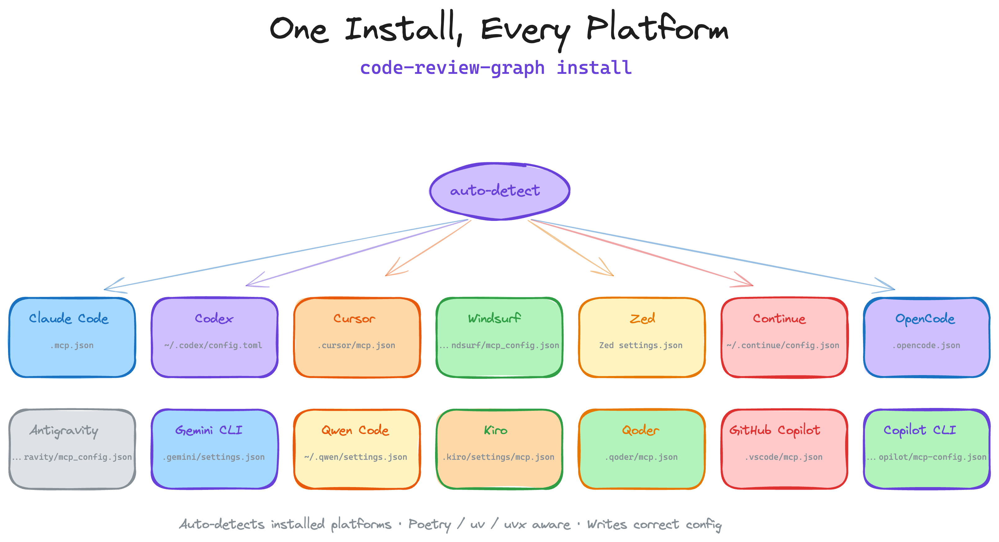
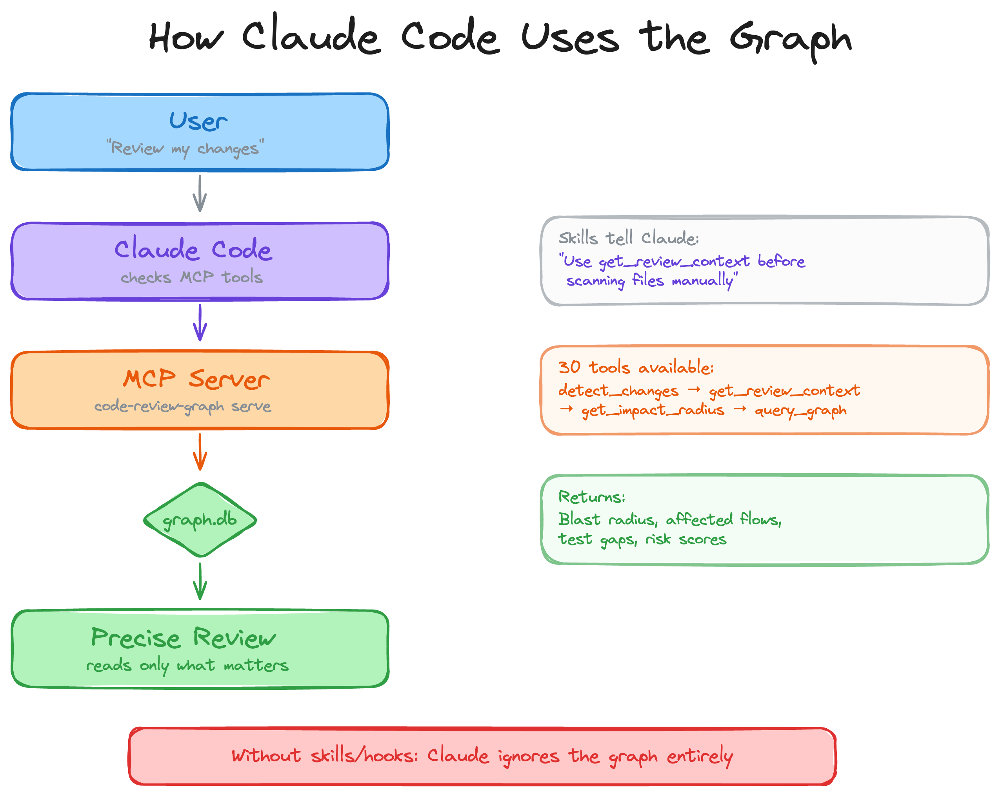
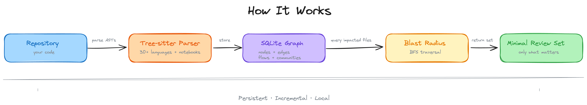
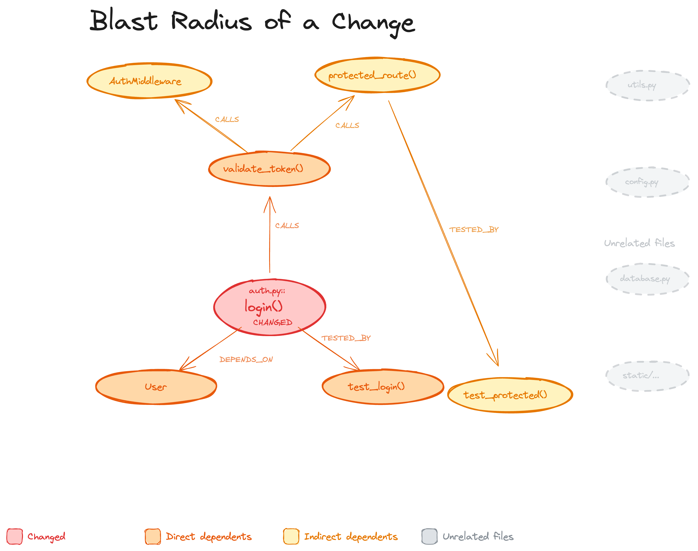
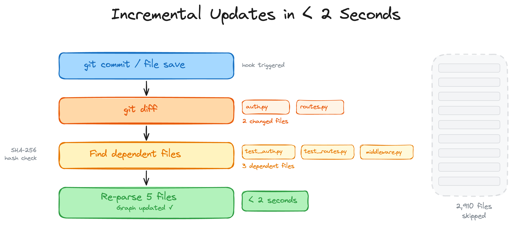
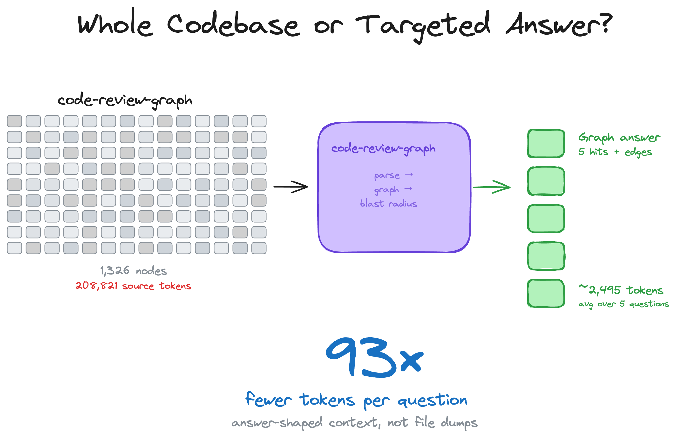
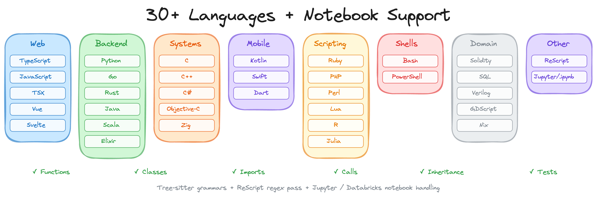
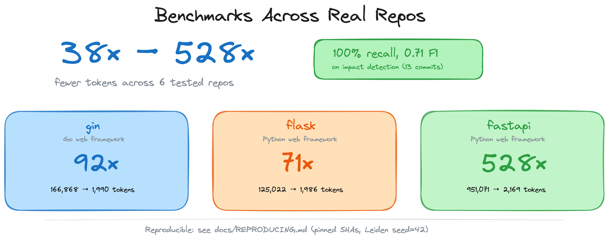

<h1 align="center">code-review-graph</h1>

<p align="center">
  <strong>Stop burning tokens. Start reviewing smarter.</strong>
</p>

<p align="center">
  <a href="README.md">English</a> |
  <a href="README.zh-CN.md">简体中文</a> |
  <a href="README.ja-JP.md">日本語</a> |
  <a href="README.ko-KR.md">한국어</a> |
  <a href="README.hi-IN.md">हिन्दी</a>
</p>

<p align="center">
  <a href="https://pypi.org/project/code-review-graph/"></a>
  <a href="https://pepy.tech/project/code-review-graph"></a>
  <a href="https://github.com/tirth8205/code-review-graph/stargazers"></a>
  <a href="https://opensource.org/licenses/MIT"></a>
  <a href="https://github.com/tirth8205/code-review-graph/actions/workflows/ci.yml"></a>
  <a href="https://www.python.org/"></a>
  <a href="https://modelcontextprotocol.io/"></a>
  <a href="https://code-review-graph.com"></a>
  <a href="https://discord.gg/3p58KXqGFN"></a>
</p>

<br>

AI coding tools re-read your entire codebase on every task. `code-review-graph` fixes that. It builds a structural map of your code with [Tree-sitter](https://tree-sitter.github.io/tree-sitter/), tracks changes incrementally, and gives your AI assistant precise context via [MCP](https://modelcontextprotocol.io/) so it reads only what matters.

<p align="center">
  
</p>

---

## Quick Start

```bash
pip install code-review-graph                     # or: pipx install code-review-graph
code-review-graph install          # auto-detects and configures all supported platforms
code-review-graph build            # parse your codebase
```

One command sets up everything. `install` detects which AI coding tools you have, writes the correct MCP configuration for each one, and injects graph-aware instructions into your platform rules. It auto-detects whether you installed via `uvx` or `pip`/`pipx` and generates the right config. Restart your editor/tool after installing.

<p align="center">
  
</p>

To target a specific platform:

```bash
code-review-graph install --platform codex       # configure only Codex
code-review-graph install --platform cursor      # configure only Cursor
code-review-graph install --platform claude-code  # configure only Claude Code
code-review-graph install --platform kiro         # configure only Kiro
```

Requires Python 3.10+. For the best experience, install [uv](https://docs.astral.sh/uv/) (the MCP config will use `uvx` if available, otherwise falls back to the `code-review-graph` command directly).

Then open your project and ask your AI assistant:

```
Build the code review graph for this project
```

The initial build takes ~10 seconds for a 500-file project. After that, the graph updates automatically on every file edit and git commit.


## How It Works

<p align="center">
  
</p>

Your repository is parsed into an AST with Tree-sitter, stored as a graph of nodes (functions, classes, imports) and edges (calls, inheritance, test coverage), then queried at review time to compute the minimal set of files your AI assistant needs to read.

<p align="center">
  
</p>

### Blast-radius analysis

When a file changes, the graph traces every caller, dependent, and test that could be affected. This is the "blast radius" of the change. Your AI reads only these files instead of scanning the whole project.

<p align="center">
  
</p>

### Incremental updates in < 2 seconds

On every git commit or file save, a hook fires. The graph diffs changed files, finds their dependents via SHA-256 hash checks, and re-parses only what changed. A 2,900-file project re-indexes in under 2 seconds.

<p align="center">
  
</p>

### The monorepo problem, solved

Large monorepos are where token waste is most painful. The graph cuts through the noise — 27,700+ files excluded from review context, only ~15 files actually read.

<p align="center">
  
</p>

### 23 languages + Jupyter notebooks

<p align="center">
  
</p>

Full Tree-sitter grammar support for functions, classes, imports, call sites, inheritance, and test detection in every language. Includes Zig, PowerShell, Julia, and Svelte SFC support. Plus Jupyter/Databricks notebook parsing (`.ipynb`) with multi-language cell support (Python, R, SQL), and Perl XS files (`.xs`).

---

## Benchmarks

<p align="center">
  
</p>

All numbers come from the automated evaluation runner against 6 real open-source repositories (13 commits total). Reproduce with `code-review-graph eval --all`. Raw data in [`evaluate/reports/summary.md`](evaluate/reports/summary.md).

<details>
<summary><strong>Token efficiency: 8.2x average reduction (naive vs graph)</strong></summary>
<br>

The graph replaces reading entire source files with a compact structural context covering blast radius, dependency chains, and test coverage gaps.

| Repo | Commits | Avg Naive Tokens | Avg Graph Tokens | Reduction |
|------|--------:|-----------------:|----------------:|----------:|
| express | 2 | 693 | 983 | 0.7x |
| fastapi | 2 | 4,944 | 614 | 8.1x |
| flask | 2 | 44,751 | 4,252 | 9.1x |
| gin | 3 | 21,972 | 1,153 | 16.4x |
| httpx | 2 | 12,044 | 1,728 | 6.9x |
| nextjs | 2 | 9,882 | 1,249 | 8.0x |
| **Average** | **13** | | | **8.2x** |

**Why express shows <1x:** For single-file changes in small packages, the graph context (metadata, edges, review guidance) can exceed the raw file size. The graph approach pays off on multi-file changes where it prunes irrelevant code.

</details>

<details>
<summary><strong>Impact accuracy: 100% recall, 0.54 average F1</strong></summary>
<br>

The blast-radius analysis never misses an actually impacted file (perfect recall). It over-predicts in some cases, which is a conservative trade-off — better to flag too many files than miss a broken dependency.

| Repo | Commits | Avg F1 | Avg Precision | Recall |
|------|--------:|-------:|--------------:|-------:|
| express | 2 | 0.667 | 0.50 | 1.0 |
| fastapi | 2 | 0.584 | 0.42 | 1.0 |
| flask | 2 | 0.475 | 0.34 | 1.0 |
| gin | 3 | 0.429 | 0.29 | 1.0 |
| httpx | 2 | 0.762 | 0.63 | 1.0 |
| nextjs | 2 | 0.331 | 0.20 | 1.0 |
| **Average** | **13** | **0.54** | **0.38** | **1.0** |

</details>

<details>
<summary><strong>Build performance</strong></summary>
<br>

| Repo | Files | Nodes | Edges | Flow Detection | Search Latency |
|------|------:|------:|------:|---------------:|---------------:|
| express | 141 | 1,910 | 17,553 | 106ms | 0.7ms |
| fastapi | 1,122 | 6,285 | 27,117 | 128ms | 1.5ms |
| flask | 83 | 1,446 | 7,974 | 95ms | 0.7ms |
| gin | 99 | 1,286 | 16,762 | 111ms | 0.5ms |
| httpx | 60 | 1,253 | 7,896 | 96ms | 0.4ms |

</details>

<details>
<summary><strong>Limitations and known weaknesses</strong></summary>
<br>

- **Small single-file changes:** Graph context can exceed naive file reads for trivial edits (see express results above). The overhead is the structural metadata that enables multi-file analysis.
- **Search quality (MRR 0.35):** Keyword search finds the right result in the top-4 for most queries, but ranking needs improvement. Express queries return 0 hits due to module-pattern naming.
- **Flow detection (33% recall):** Only reliably detects entry points in Python repos (fastapi, httpx) where framework patterns are recognized. JavaScript and Go flow detection needs work.
- **Precision vs recall trade-off:** Impact analysis is deliberately conservative. It flags files that *might* be affected, which means some false positives in large dependency graphs.

</details>

---

## Features

| Feature | Details |
|---------|---------|
| **Incremental updates** | Re-parses only changed files. Subsequent updates complete in under 2 seconds. |
| **23 languages + notebooks** | Python, TypeScript/TSX, JavaScript, Vue, Svelte, Go, Rust, Java, Scala, C#, Ruby, Kotlin, Swift, PHP, Solidity, C/C++, Dart, R, Perl, Lua, Zig, PowerShell, Julia, Jupyter/Databricks (.ipynb) |
| **Blast-radius analysis** | Shows exactly which functions, classes, and files are affected by any change |
| **Auto-update hooks** | Graph updates on every file edit and git commit without manual intervention |
| **Semantic search** | Optional vector embeddings via sentence-transformers, Google Gemini, MiniMax, or any OpenAI-compatible endpoint (real OpenAI, Azure, new-api, LiteLLM, vLLM, LocalAI) |
| **Interactive visualisation** | D3.js force-directed graph with search, community legend toggles, and degree-scaled nodes |
| **Hub & bridge detection** | Find most-connected nodes and architectural chokepoints via betweenness centrality |
| **Surprise scoring** | Detect unexpected coupling: cross-community, cross-language, peripheral-to-hub edges |
| **Knowledge gap analysis** | Identify isolated nodes, untested hotspots, thin communities, and structural weaknesses |
| **Suggested questions** | Auto-generated review questions from graph analysis (bridges, hubs, surprises) |
| **Edge confidence** | Three-tier confidence scoring (EXTRACTED/INFERRED/AMBIGUOUS) with float scores on edges |
| **Graph traversal** | Free-form BFS/DFS exploration from any node with configurable depth and token budget |
| **Export formats** | GraphML (Gephi/yEd), Neo4j Cypher, Obsidian vault with wikilinks, SVG static graph |
| **Graph diff** | Compare graph snapshots over time: new/removed nodes, edges, community changes |
| **Token benchmarking** | Measure naive full-corpus tokens vs graph query tokens with per-question ratios |
| **Memory loop** | Persist Q&A results as markdown for re-ingestion, so the graph grows from queries |
| **Community auto-split** | Oversized communities (>25% of graph) are recursively split via Leiden |
| **Execution flows** | Trace call chains from entry points, sorted by weighted criticality |
| **Community detection** | Cluster related code via Leiden algorithm with resolution scaling for large graphs |
| **Architecture overview** | Auto-generated architecture map with coupling warnings |
| **Risk-scored reviews** | `detect_changes` maps diffs to affected functions, flows, and test gaps |
| **Refactoring tools** | Rename preview, framework-aware dead code detection, community-driven suggestions |
| **Wiki generation** | Auto-generate markdown wiki from community structure |
| **Multi-repo registry** | Register multiple repos, search across all of them |
| **Multi-repo daemon** | `crg-daemon` watches multiple repos as child processes, with health checks and auto-restart |
| **MCP prompts** | 5 workflow templates: review, architecture, debug, onboard, pre-merge |
| **Full-text search** | FTS5-powered hybrid search combining keyword and vector similarity |
| **Local storage** | SQLite file in `.code-review-graph/`. No external database, no cloud dependency. |
| **Watch mode** | Continuous graph updates as you work |

---

## Usage

<details>
<summary><strong>Slash commands</strong></summary>
<br>

| Command | Description |
|---------|-------------|
| `/code-review-graph:build-graph` | Build or rebuild the code graph |
| `/code-review-graph:review-delta` | Review changes since last commit |
| `/code-review-graph:review-pr` | Full PR review with blast-radius analysis |

</details>

<details>
<summary><strong>CLI reference</strong></summary>
<br>

```bash
code-review-graph install          # Auto-detect and configure all platforms
code-review-graph install --platform <name>  # Target a specific platform
code-review-graph build            # Parse entire codebase
code-review-graph update           # Incremental update (changed files only)
code-review-graph status           # Graph statistics
code-review-graph watch            # Auto-update on file changes
code-review-graph visualize        # Generate interactive HTML graph
code-review-graph visualize --format graphml   # Export as GraphML
code-review-graph visualize --format svg       # Export as SVG
code-review-graph visualize --format obsidian  # Export as Obsidian vault
code-review-graph visualize --format cypher    # Export as Neo4j Cypher
code-review-graph wiki             # Generate markdown wiki from communities
code-review-graph detect-changes   # Risk-scored change impact analysis
code-review-graph register <path>  # Register repo in multi-repo registry
code-review-graph unregister <id>  # Remove repo from registry
code-review-graph repos            # List registered repositories
code-review-graph daemon start     # Start multi-repo watch daemon
code-review-graph daemon stop      # Stop the daemon
code-review-graph daemon status    # Show daemon status and repos
code-review-graph eval             # Run evaluation benchmarks
code-review-graph serve            # Start MCP server
```

</details>

<details>
<summary><strong>Multi-repo daemon</strong></summary>
<br>

If your editor doesn't support hooks (e.g. Cursor, OpenCode), or you just want your
graph to stay fresh in the background without any editor integration, the daemon is
for you. It watches your repos for file changes and automatically rebuilds the graph
— no manual `build` or `update` commands needed.

The daemon is included with `code-review-graph` — no separate install required.

**Quick setup:**

```bash
# 1. Register the repos you want to watch
crg-daemon add ~/project-a --alias proj-a
crg-daemon add ~/project-b

# 2. Start the daemon (runs in the background)
crg-daemon start

# 3. That's it — graphs stay up to date automatically
crg-daemon status                 # check daemon and per-repo watcher status
crg-daemon logs --repo proj-a -f  # tail logs for a specific repo
crg-daemon stop                   # stop daemon and all watcher processes
```

Also available as `code-review-graph daemon start|stop|status|...`.

Under the hood, `crg-daemon add` writes to a TOML config file at
`~/.code-review-graph/watch.toml`. You can also edit this file directly:

```toml
[[repos]]
path = "/home/user/project-a"
alias = "proj-a"

[[repos]]
path = "/home/user/project-b"
alias = "project-b"
```

The daemon monitors this config file for changes and automatically starts/stops
watcher processes as repos are added or removed. Health checks every 30 seconds
restart dead watchers. No external dependencies required.

See [docs/COMMANDS.md](docs/COMMANDS.md#standalone-daemon-cli-crg-daemon) for the
full config reference and all available options.

</details>

<details>
<summary><strong>28 MCP tools</strong></summary>
<br>

Your AI assistant uses these automatically once the graph is built.

| Tool | Description |
|------|-------------|
| `build_or_update_graph_tool` | Build or incrementally update the graph |
| `get_minimal_context_tool` | Ultra-compact context (~100 tokens) — call this first |
| `get_impact_radius_tool` | Blast radius of changed files |
| `get_review_context_tool` | Token-optimised review context with structural summary |
| `query_graph_tool` | Callers, callees, tests, imports, inheritance queries |
| `traverse_graph_tool` | BFS/DFS traversal from any node with token budget |
| `semantic_search_nodes_tool` | Search code entities by name or meaning |
| `embed_graph_tool` | Compute vector embeddings for semantic search |
| `list_graph_stats_tool` | Graph size and health |
| `get_docs_section_tool` | Retrieve documentation sections |
| `find_large_functions_tool` | Find functions/classes exceeding a line-count threshold |
| `list_flows_tool` | List execution flows sorted by criticality |
| `get_flow_tool` | Get details of a single execution flow |
| `get_affected_flows_tool` | Find flows affected by changed files |
| `list_communities_tool` | List detected code communities |
| `get_community_tool` | Get details of a single community |
| `get_architecture_overview_tool` | Architecture overview from community structure |
| `detect_changes_tool` | Risk-scored change impact analysis for code review |
| `get_hub_nodes_tool` | Find most-connected nodes (architectural hotspots) |
| `get_bridge_nodes_tool` | Find chokepoints via betweenness centrality |
| `get_knowledge_gaps_tool` | Identify structural weaknesses and untested hotspots |
| `get_surprising_connections_tool` | Detect unexpected cross-community coupling |
| `get_suggested_questions_tool` | Auto-generated review questions from analysis |
| `refactor_tool` | Rename preview, dead code detection, suggestions |
| `apply_refactor_tool` | Apply a previously previewed refactoring |
| `generate_wiki_tool` | Generate markdown wiki from communities |
| `get_wiki_page_tool` | Retrieve a specific wiki page |
| `list_repos_tool` | List registered repositories |
| `cross_repo_search_tool` | Search across all registered repositories |

**MCP Prompts** (5 workflow templates):
`review_changes`, `architecture_map`, `debug_issue`, `onboard_developer`, `pre_merge_check`

</details>

<details>
<summary><strong>Configuration</strong></summary>
<br>

To exclude paths from indexing, create a `.code-review-graphignore` file in your repository root:

```
generated/**
*.generated.ts
vendor/**
node_modules/**
```

Note: in git repos, only tracked files are indexed (`git ls-files`), so gitignored files are skipped automatically. Use `.code-review-graphignore` to exclude tracked files or when git isn't available.

Optional dependency groups:

```bash
pip install code-review-graph[embeddings]          # Local vector embeddings (sentence-transformers)
pip install code-review-graph[google-embeddings]   # Google Gemini embeddings
pip install code-review-graph[communities]         # Community detection (igraph)
pip install code-review-graph[eval]                # Evaluation benchmarks (matplotlib)
pip install code-review-graph[wiki]                # Wiki generation with LLM summaries (ollama)
pip install code-review-graph[all]                 # All optional dependencies
```

### Environment Variables

| Variable | Description | Default |
|----------|-------------|---------|
| `CRG_GIT_TIMEOUT` | Timeout in seconds for Git operations | `30` |
| `CRG_EMBEDDING_MODEL` | Default model for vector embeddings | `all-MiniLM-L6-v2` |
| `CRG_MAX_IMPACT_NODES` | Maximum nodes to include in impact analysis | `500` |
| `CRG_MAX_IMPACT_DEPTH` | Search depth for blast-radius analysis | `2` |
| `CRG_MAX_BFS_DEPTH` | Maximum depth for graph traversal | `15` |
| `GOOGLE_API_KEY` | API key for Google Gemini embeddings | - |
| `MINIMAX_API_KEY` | API key for MiniMax embeddings | - |
| `CRG_OPENAI_BASE_URL` | OpenAI-compatible embeddings endpoint | - |
| `CRG_OPENAI_API_KEY` | API key for OpenAI-compatible embeddings | - |
| `CRG_OPENAI_MODEL` | Model name for OpenAI-compatible embeddings | - |
| `CRG_OPENAI_DIMENSION` | Pin embedding dimension (v3 models support reduction) | - |
| `NO_COLOR` | If set, disables ANSI colors in terminal | - |
| `CRG_SERIAL_PARSE` | If `1`, disables parallel parsing (use for debugging) | - |

OpenAI-compatible embeddings (real OpenAI, Azure, or any self-hosted gateway like
new-api / LiteLLM / vLLM / LocalAI / Ollama in openai mode) need no extra install —
just set the environment variables and pass `provider="openai"` to `embed_graph`:

```bash
export CRG_OPENAI_BASE_URL=http://127.0.0.1:3000/v1     # or https://api.openai.com/v1
export CRG_OPENAI_API_KEY=sk-...
export CRG_OPENAI_MODEL=text-embedding-3-small          # whatever your gateway serves
# optional:
export CRG_OPENAI_DIMENSION=1536                        # pin dim (v3 models support reduction)
export CRG_OPENAI_BATCH_SIZE=100                        # lower for gateways with tight limits
                                                        # (e.g. Qwen text-embedding-v4 caps at 10)
```

The cloud-egress warning is auto-skipped when the base URL points to localhost
(`127.0.0.1`, `localhost`, `0.0.0.0`, `::1`).

> **Model selection tip.** Avoid `-preview` / `-beta` / `-exp` model IDs
> (e.g. `google/gemini-embedding-2-preview`) for anything you plan to keep
> long-term — preview models can change weights (different dimension → full
> re-embed required) or be deprecated without notice. Prefer stable GA
> releases such as `text-embedding-3-small` / `text-embedding-3-large` (OpenAI),
> `Qwen/Qwen3-Embedding-8B` (via self-hosted vLLM / LocalAI), or
> `gemini-embedding-001` (via the native Gemini provider, which requires
> `GOOGLE_API_KEY` instead of the OpenAI-compatible path).
>
> Also note: `code-review-graph` currently embeds **function signatures only**
> (~10 tokens per node, e.g. `"parse_file function (path: str) returns Tree"`).
> Models whose headline quality comes from long-context body understanding
> (such as Gemini 2 or Qwen3-8B at their MTEB-code SOTA scores) will see a
> much narrower quality gap against smaller models at this input length.
> Body/docstring embedding is tracked as a follow-up enhancement.

#### Tool Filtering

CRG exposes 28 MCP tools by default. In token-constrained environments, you can
limit the server to a subset of tools using `--tools` or the `CRG_TOOLS`
environment variable:

```bash
# Via CLI flag
code-review-graph serve --tools query_graph_tool,semantic_search_nodes_tool,detect_changes_tool

# Via environment variable
CRG_TOOLS=query_graph_tool,semantic_search_nodes_tool code-review-graph serve
```

The CLI flag takes precedence over the environment variable. When neither is set,
all tools are available. This is especially useful for MCP client configurations:

```json
{
  "mcpServers": {
    "code-review-graph": {
      "command": "code-review-graph",
      "args": ["serve", "--tools", "query_graph_tool,semantic_search_nodes_tool,detect_changes_tool,get_review_context_tool"]
    }
  }
}
```

</details>

---

## Troubleshooting

### `pip` / `pipx` cannot download `hatchling` (or `Errno 9` / `Bad file descriptor` to PyPI)

Installing from a **source tree** (for example `pipx install .`) needs build dependencies from **PyPI** (for example `hatchling`). If you see `Could not find a version that satisfies the requirement hatchling` after connection warnings, the Python/pip in that **terminal** may not be able to open an HTTPS client to `pypi.org` (sometimes seen in an integrated editor terminal; less often system-wide with VPN, firewall, or proxy).

**Options:**

1. Run the same command from **macOS Terminal.app** (or iTerm) instead of the IDE’s terminal, then retry `pipx install .` or `pipx install "git+https://..."` .
2. Use **[uv](https://docs.astral.sh/uv/)** to install the CLI from a checkout (uses different download machinery than `pip` in many cases):

   ```bash
   cd /path/to/code-review-graph
   uv tool install . --force
   ```

3. For **development in a clone** without a global install, use `uv sync` and `uv run code-review-graph …` (or activate `.venv` after `uv sync`).

**Diagnose (optional):** `python3 scripts/diagnose_pypi_connectivity.py` — if it prints `FAILED`, the issue is environment/network, not a wrong package name in this repo.

### Windows Configuration Issues (Invalid JSON / Connection Closed)
If you are using Windows and encounter `Invalid JSON: EOF while parsing` or `MCP error -32000: Connection closed` when connecting via Claude Code, do not use the `cmd /c` wrapper in your config.

Ensure `fastmcp` is updated to at least `3.2.4+`. Then, configure your `~/.claude.json` to execute the `.exe` directly and pass the UTF-8 environment variable via the config:

```json
"code-review-graph": {
  "command": "C:\\path\\to\\your\\venv\\Scripts\\code-review-graph.exe",
  "args": ["serve", "--repo", "C:\\path\\to\\your\\project"],
  "env": { "PYTHONUTF8": "1" }
}
```

## Contributing

```bash
git clone https://github.com/tirth8205/code-review-graph.git
cd code-review-graph
python3 -m venv .venv && source .venv/bin/activate
pip install -e ".[dev]"
pytest
```

<details>
<summary><strong>Adding a new language</strong></summary>
<br>

Edit `code_review_graph/parser.py` and add your extension to `EXTENSION_TO_LANGUAGE` along with node type mappings in `_CLASS_TYPES`, `_FUNCTION_TYPES`, `_IMPORT_TYPES`, and `_CALL_TYPES`. Include a test fixture and open a PR.

</details>

## Licence

MIT. See [LICENSE](LICENSE).

<p align="center">
<br>
<a href="https://code-review-graph.com">code-review-graph.com</a><br><br>
<code>pip install code-review-graph && code-review-graph install</code><br>
<sub>Works with Codex, Claude Code, Cursor, Windsurf, Zed, Continue, OpenCode, Antigravity, Qwen, Qoder, and Kiro</sub>
</p>
