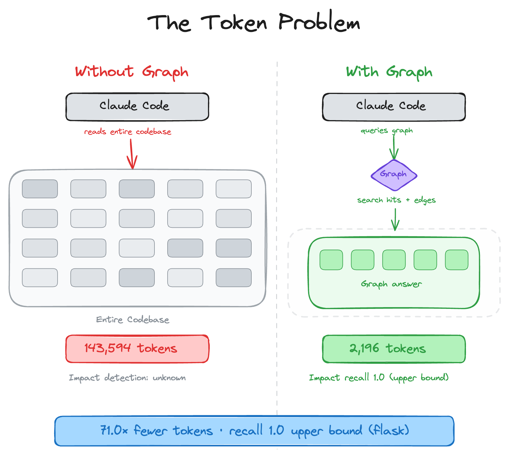
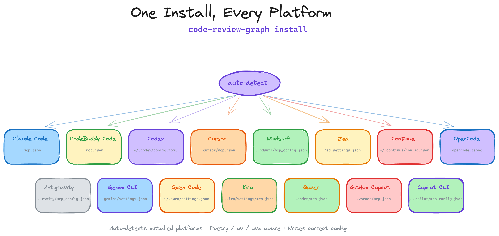
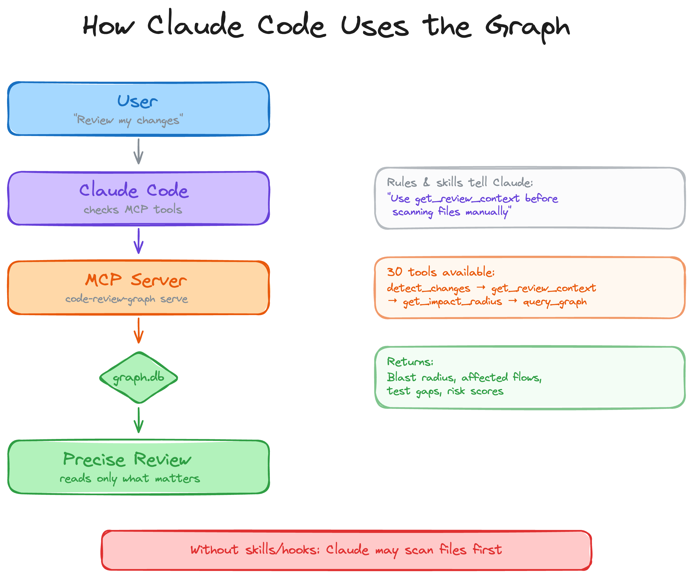
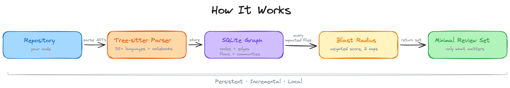
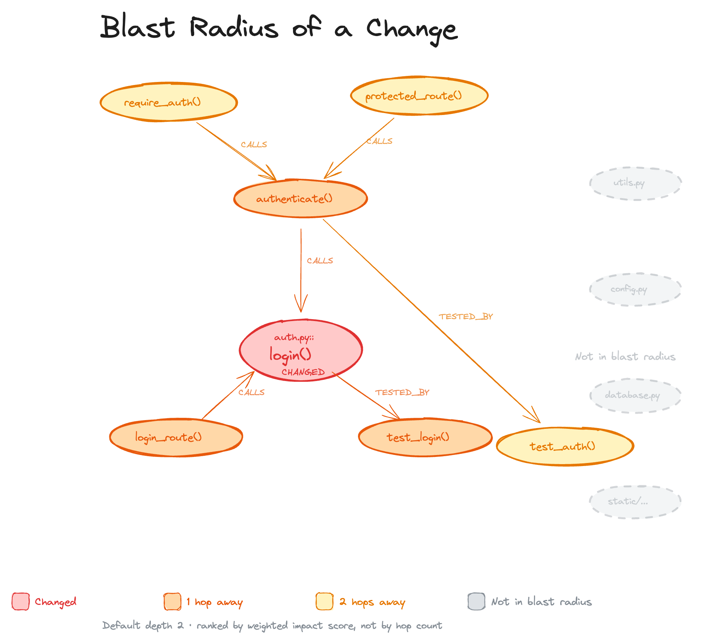
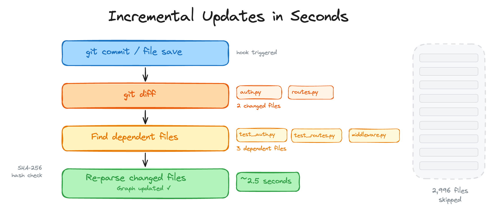
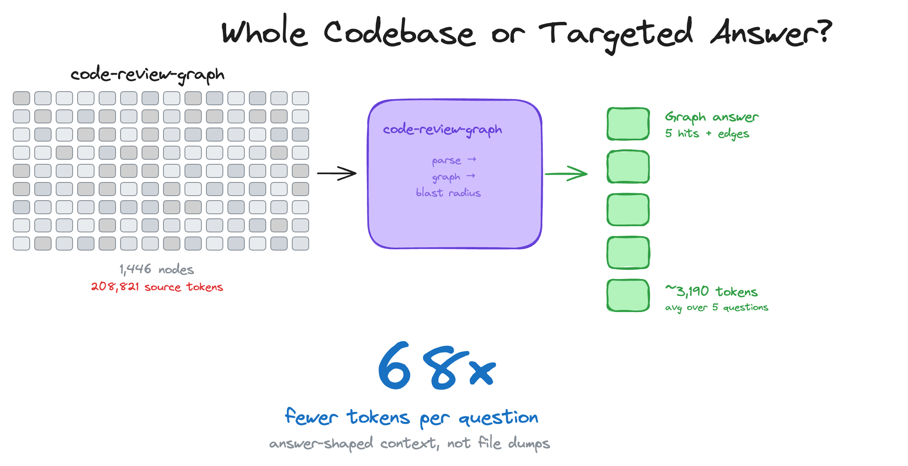
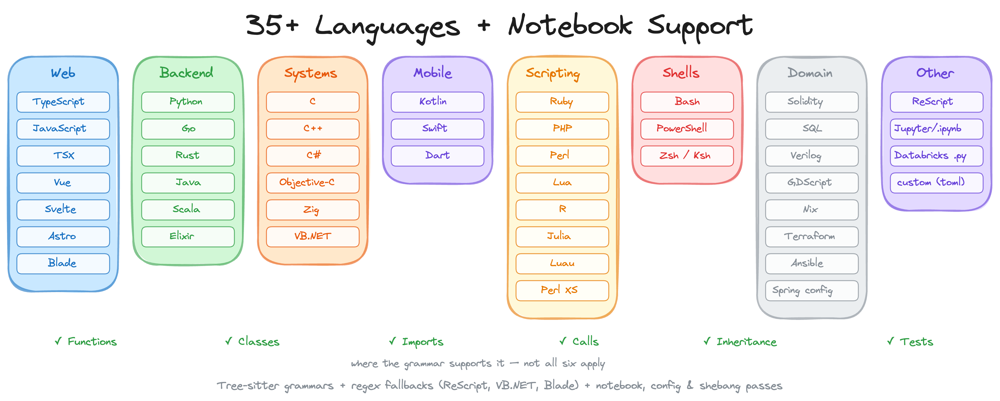
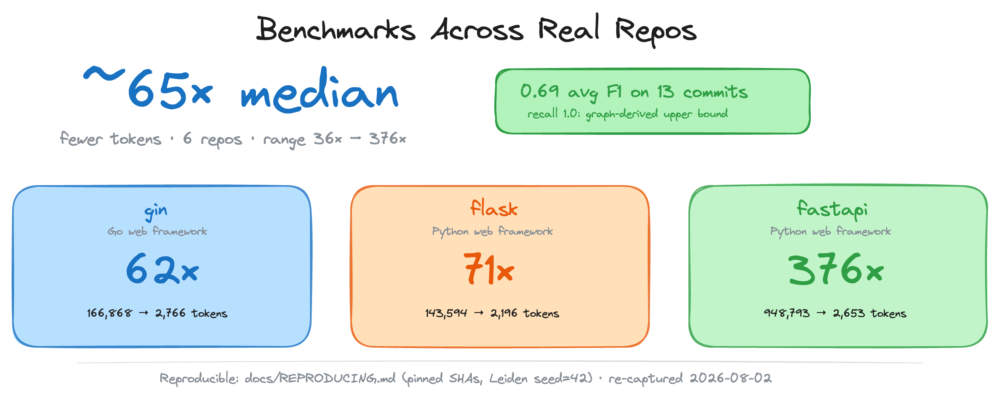

<h1 align="center">code-review-graph</h1>

<p align="center">
  <a href="https://trendshift.io/repositories/23329?utm_source=repository-badge&amp;utm_medium=badge&amp;utm_campaign=badge-repository-23329"
     target="_blank"
     rel="noopener noreferrer">
    
  </a>
</p>

<p align="center">
  <strong>Хватит сжигать токены. Начните ревьюить умнее.</strong>
</p>
<p align="center">
  <a href="README.md">English</a> |
  <a href="README.zh-CN.md">简体中文</a> |
  <a href="README.ja-JP.md">日本語</a> |
  <a href="README.ko-KR.md">한국어</a> |
  <a href="README.hi-IN.md">हिन्दी</a> |
  <a href="README.ru.md">Русский</a>
</p>

<p align="center">
  <a href="https://pypi.org/project/code-review-graph/"></a>
  <a href="https://pepy.tech/project/code-review-graph"></a>
  <a href="https://github.com/tirth8205/code-review-graph/stargazers"></a>
  <a href="https://opensource.org/licenses/MIT"></a>
  <a href="https://github.com/tirth8205/code-review-graph/actions/workflows/ci.yml"></a>
  <a href="https://www.python.org/"></a>
  <a href="https://modelcontextprotocol.io/"></a>
  <a href="https://code-review-graph.com"></a>
  <a href="https://discord.gg/3p58KXqGFN"></a>
</p>

<p align="center">
  <a href="docs/USAGE.md">Usage</a> ·
  <a href="docs/COMMANDS.md">Commands</a> ·
  <a href="docs/FAQ.md">FAQ</a> ·
  <a href="docs/TROUBLESHOOTING.md">Troubleshooting</a> ·
  <a href="docs/GITHUB_ACTION.md">GitHub Action</a> ·
  <a href="docs/REPRODUCING.md">Reproducing the benchmarks</a> ·
  <a href="docs/ROADMAP.md">Roadmap</a>
</p>

<br>

AI coding tools на задачах code review часто перечитывают большие куски кодовой базы. `code-review-graph` это исправляет: строит структурную карту кода через [Tree-sitter](https://tree-sitter.github.io/tree-sitter/), отслеживает изменения инкрементально и через [MCP](https://modelcontextprotocol.io/) отдаёт ассистенту точный контекст — только то, что нужно.

<p align="center">
  
</p>

---

## Быстрый старт

```bash
pip install code-review-graph                     # or: pipx install code-review-graph
code-review-graph install          # auto-detects and configures all supported platforms
code-review-graph build            # parse your codebase
```

Одна команда настраивает всё. `install` определяет установленные AI coding tools, пишет MCP-конфиг, ставит platform-native hooks/skills где поддерживается и внедряет graph-aware инструкции в rules. Автоопределяет `uvx` vs `pip`/`pipx`. После install перезапустите редактор/инструмент.

<p align="center">
  
</p>

Конкретная платформа:

```bash
code-review-graph install --platform codex       # configure only Codex
code-review-graph install --platform cursor      # configure only Cursor
code-review-graph install --platform claude-code  # configure only Claude Code
code-review-graph install --platform gemini-cli   # configure only Gemini CLI
code-review-graph install --platform kiro         # configure only Kiro
code-review-graph install --platform copilot      # configure only GitHub Copilot (VS Code)
code-review-graph install --platform copilot-cli  # configure only GitHub Copilot CLI
code-review-graph install --platform codebuddy    # configure only CodeBuddy Code
```

Нужен Python 3.10+. Для лучшего опыта поставьте [uv](https://docs.astral.sh/uv/) (MCP-конфиг использует `uvx`, если доступен).

Удаление из Git/SVN-проекта — симметричная команда `uninstall` из working tree. Цель нормализуется к корню дерева; non-repo директории отклоняются. Удаляются только артефакты CRG; чужие MCP/hooks/skills/JSONC не трогаются. Shared config пишется атомарно.

```bash
code-review-graph uninstall --dry-run    # preview every action; write nothing
code-review-graph uninstall              # preview, ask for confirmation, then apply
code-review-graph uninstall --yes        # apply without prompting
code-review-graph uninstall --all-repos  # also clean every registered repository
code-review-graph uninstall --keep-data  # remove integrations but keep graph databases
code-review-graph uninstall --keep-user-configs --repo .  # clean this project only
```

Затем откройте проект и попросите ассистента:

```
Build the code review graph for this project
```

Первый build ~10 секунд на 500 файлов. Дальше watch mode и hooks держат граф актуальным.

---

## Как это работает

<p align="center">
  
</p>

Репозиторий парсится в AST (Tree-sitter), хранится как граф узлов (функции, классы, imports) и рёбер (calls, inheritance, test coverage), а на review вычисляется минимальный набор файлов для чтения.

<p align="center">
  
</p>

### Blast-radius analysis

При изменении файла граф прослеживает callers, dependents и tests. Это «радиус поражения» (blast radius). Ассистент читает только эти файлы, а не весь проект.

<p align="center">
  
</p>

### Инкрементальные обновления &lt; 2 секунд

При hooks/watch сохранение файлов и commit hooks запускают инкрементальный update: diff изменённых файлов, dependents через SHA-256, re-parse только изменённого. Проект на 2 900 файлов — re-index менее 2 секунд.

<p align="center">
  
</p>

### Monorepo: решено

В больших monorepo токены сгорают сильнее всего. Граф режет шум — 27 700+ файлов вне review-контекста, реально читается ~15.

<p align="center">
  
</p>

### Широкое покрытие языков + Jupyter

<p align="center">
  
</p>

Парсер покрывает functions, classes, imports, call sites, inheritance и test detection (Tree-sitter + targeted fallbacks). Поддержка включает Python, JavaScript/TypeScript/TSX, Go, Rust, Java, C/C++, C#, VB.NET, Ruby, Kotlin, Swift, PHP, Scala, Solidity, Dart, R, Perl, Lua/Luau, Objective-C, shell, Elixir, Zig, PowerShell, Julia, ReScript, GDScript, Nix, Verilog/SystemVerilog, SQL, Terraform/OpenTofu (`.tf`), Ansible, Vue/Svelte SFC, Astro (через TypeScript parser), Jupyter/Databricks (`.ipynb`), Perl XS (`.xs`). Generic YAML как исходники не считается.

Для PHP дополнительно: repository-bounded Composer PSR-4, Blade templates, Laravel Route/Eloquent semantic edges при явных framework imports.

### Свой язык без форка

Если языка нет в парсере — `languages.toml` в `.code-review-graph/` (расширения → grammar из `tree_sitter_language_pack` + node types). См. [docs/CUSTOM_LANGUAGES.md](docs/CUSTOM_LANGUAGES.md).

```toml
[languages.erlang]
extensions = [".erl"]
grammar = "erlang"
function_node_types = ["function_clause"]
class_node_types = ["record_decl"]
import_node_types = ["import_attribute"]
call_node_types = ["call"]
```

### Risk-scored PR reviews в CI (GitHub Action)

Тот же анализ — composite GitHub Action, local-first: граф строится и запрашивается **на CI runner**, исходники наружу не уходят. На каждый PR — sticky comment с risk-scored functions, affected flows и test gaps. Опционально `fail-on-risk` как merge gate.

```yaml
# .github/workflows/code-review-graph.yml
on:
  pull_request:

permissions:
  contents: read
  pull-requests: write

jobs:
  review:
    runs-on: ubuntu-latest
    steps:
      - uses: actions/checkout@v7
      - uses: tirth8205/code-review-graph@v2.3.6
        with:
          github-token: ${{ secrets.GITHUB_TOKEN }}
```

Подробнее: [docs/GITHUB_ACTION.md](docs/GITHUB_ACTION.md).

---

## Бенчмарки

<p align="center">
  
</p>

**Ключевая цифра: median per-question token reduction по 6 репо — ~82x** (whole-corpus baseline vs graph query). Часто цитируемый **528x — максимум** (лучший кейс, fastapi), не «типичный» результат.

Числа из automated evaluation на 6 open-source репозиториях (13 commits). Полный recipe: [`docs/REPRODUCING.md`](docs/REPRODUCING.md).

<details>
<summary><strong>Token efficiency: ~82x median (диапазон 38x–528x)</strong></summary>
<br>

| Repo | Snapshot SHA | naive_corpus_tokens | avg graph_tokens | Reduction |
|------|---|-----------------:|----------------:|----------:|
| fastapi | `0227991a` | 951,071 | 2,169 | **528.4x** |
| code-review-graph | `84bde354` | 208,821 | 2,495 | **93.0x** |
| gin | `5c00df8a` | 166,868 | 1,990 | **91.8x** |
| flask | `a29f88ce` | 125,022 | 1,986 | **71.4x** |
| express | `b4ab7d65` | 135,955 | 3,465 | **40.6x** |
| httpx | `b55d4635` | 89,492 | 2,438 | **38.0x** |

Median: **~82x**. Методология и caveats — в English README / `docs/REPRODUCING.md`.

</details>

<details>
<summary><strong>Impact accuracy: average F1 0.71 (recall 1.0 — graph-derived upper bound, circular)</strong></summary>
<br>

| Repo | Commits | Avg F1 | Avg Precision | Recall (graph-derived upper bound) |
|------|--------:|-------:|--------------:|-------:|
| httpx | 2 | 0.864 | 0.786 | 1.0 |
| fastapi | 2 | 0.834 | 0.750 | 1.0 |
| code-review-graph | 2 | 0.734 | 0.584 | 1.0 |
| express | 2 | 0.667 | 0.500 | 1.0 |
| flask | 2 | 0.628 | 0.481 | 1.0 |
| gin | 3 | 0.609 | 0.439 | 1.0 |
| **Average** | **13** | **0.714** | **0.578** | **1.000** |

**Важно:** recall 1.0 в graph-derived mode — upper bound (ground truth из того же графа). Есть честный co-change mode против git history.

</details>

### Ограничения

- Impact «recall 1.0» circular / upper bound  
- На tiny single-file diffs graph context может быть тяжелее naive read  
- Search quality (MRR ~0.35) — есть запас  
- Flow detection ~33% recall — сильнее на Python/PHP Laravel  
- Precision vs recall: impact намеренно conservative (лишние false positives лучше, чем miss)

---

## Возможности

| Feature | Details |
|---------|---------|
| **Incremental updates** | Re-parse только изменённых файлов; update &lt; 2s |
| **Broad language + notebooks** | Python, JS/TS/TSX, Go, Rust, Java, C/C++, C#, VB.NET, Ruby, Kotlin, Swift, PHP, Scala, Solidity, Dart, R, Perl, Lua/Luau, Obj-C, shell, Elixir, Zig, PowerShell, Julia, ReScript, GDScript, Nix, Verilog/SystemVerilog, SQL, Terraform, Ansible, Vue/Svelte, Astro, Jupyter/Databricks, Perl XS |
| **Framework-aware PHP** | Composer PSR-4, Blade, Laravel Route/Eloquent edges |
| **Blast-radius analysis** | Какие functions/classes/files затронуты изменением |
| **Auto-update hooks** | Watch + commit hooks |
| **Semantic search** | sentence-transformers, Gemini, MiniMax, OpenAI-compatible endpoints |
| **Interactive visualisation** | D3 force graph, search, community legend |
| **Hub & bridge detection** | Горячие точки и chokepoints (betweenness) |
| **Surprise scoring** | Неожиданный coupling cross-community / language |
| **Knowledge gap analysis** | Isolated nodes, untested hotspots |
| **Suggested questions** | Авто-вопросы для review |
| **Edge confidence** | EXTRACTED / INFERRED / AMBIGUOUS |
| **Graph traversal** | BFS/DFS с token budget |
| **Export** | GraphML, Neo4j Cypher, Obsidian, SVG |
| **Graph diff** | Снимки во времени |
| **Token benchmarking** | naive corpus vs graph query |
| **Context savings** | `context_savings` metadata на MCP/CLI outputs |
| **Memory loop** | Q&A → markdown re-ingestion |
| **Community auto-split** | Leiden, oversized communities |
| **Execution flows** | Call chains от entry points |
| **Architecture overview** | Карта + coupling warnings |
| **Risk-scored reviews** | `detect_changes` → functions, flows, test gaps |
| **Custom languages** | `.code-review-graph/languages.toml` |
| **GitHub Action** | Sticky PR comments + optional merge gate |
| **Refactoring tools** | Rename preview, dead code, suggestions |
| **Wiki generation** | Markdown wiki из communities |
| **Multi-repo registry / daemon** | Несколько репо, `crg-daemon` |
| **MCP prompts** | review, architecture, debug, onboard, pre-merge |
| **FTS5 hybrid search** | keyword + vector |
| **Local storage** | SQLite в `.code-review-graph/` |
| **Watch mode** | Непрерывные обновления |

---

## Использование

<details>
<summary><strong>Slash-команды</strong></summary>
<br>

| Command | Description |
|---------|-------------|
| `/code-review-graph:build-graph` | Собрать / пересобрать граф |
| `/code-review-graph:review-delta` | Review изменений с последнего commit |
| `/code-review-graph:review-pr` | Полный PR review с blast-radius |

</details>

<details>
<summary><strong>CLI</strong></summary>
<br>

```bash
code-review-graph install          # Auto-detect and configure all platforms
code-review-graph install --platform <name>  # Target a specific platform
code-review-graph uninstall --dry-run  # Preview safe removal of installed artifacts
code-review-graph build            # Parse entire codebase
code-review-graph update           # Incremental update (changed files only)
code-review-graph status           # Graph statistics
code-review-graph watch            # Auto-update on file changes
code-review-graph visualize        # Generate interactive HTML graph
code-review-graph visualize --format json      # Export local graph data as JSON
code-review-graph visualize --format graphml   # Export as GraphML
code-review-graph visualize --format svg       # Export as SVG
code-review-graph visualize --format obsidian  # Export as Obsidian vault
code-review-graph visualize --format cypher    # Export as Neo4j Cypher
code-review-graph wiki             # Generate markdown wiki from communities
code-review-graph detect-changes --brief         # Risk panel + token savings (read-only)
code-review-graph update --brief                 # Refresh graph + same panel
code-review-graph detect-changes --brief --verify  # Cross-check vs tiktoken
code-review-graph register <path>  # Register repo in multi-repo registry
code-review-graph unregister <id>  # Remove repo from registry
code-review-graph repos            # List registered repositories
code-review-graph daemon start     # Start multi-repo watch daemon
code-review-graph daemon stop      # Stop the daemon
code-review-graph daemon status    # Show daemon status and repos
code-review-graph eval             # Run evaluation benchmarks
code-review-graph serve            # Start MCP server
```

</details>

<details>
<summary><strong>Token Savings: <code>detect-changes --brief</code> vs <code>update --brief</code></strong></summary>
<br>

Оба печатают панель «сколько токенов сэкономлено» vs raw changed files. Разница — обновляется ли граф перед анализом.

```text
┌─────────────────────── Token Savings ────────────────────────┐
│ Full context would be:     12,921 tokens                     │
│ Graph context used:           762 tokens                     │
│ Saved:                     12,159 tokens (~94%)              │
│ Breakdown: Functions 244 · Tests 191 · Risk 244 · Other 83   │
└──────────────────────────────────────────────────────────────┘
```

| Command | Что делает | Когда |
|---|---|---|
| `detect-changes --brief` | Read-only по **существующему** графу (~1s) | Обычно достаточно |
| `update --brief` | Сначала re-parse changed files, потом панель (~5s) | После rebase / stale graph |

`--verify` — сверка с `cl100k_base` (tiktoken).

</details>

<details>
<summary><strong>Multi-repo daemon</strong></summary>
<br>

Если редактор без hooks (Cursor, OpenCode) или нужен background freshness:

```bash
crg-daemon add ~/project-a --alias proj-a
crg-daemon add ~/project-b
crg-daemon start
crg-daemon status
crg-daemon logs --repo proj-a -f
crg-daemon stop
```

Также: `code-review-graph daemon start|stop|status|...`. Конфиг: `~/.code-review-graph/watch.toml`.  
См. [docs/COMMANDS.md](docs/COMMANDS.md#standalone-daemon-cli-crg-daemon).

</details>

<details>
<summary><strong>30 MCP tools</strong></summary>
<br>

Ассистент использует их автоматически после build.

| Tool | Description |
|------|-------------|
| `build_or_update_graph_tool` | Build / incremental update |
| `run_postprocess_tool` | Flows, communities, FTS |
| `get_minimal_context_tool` | Ultra-compact (~100 tokens) — вызывать первым |
| `get_impact_radius_tool` | Blast radius |
| `get_review_context_tool` | Token-optimised review context |
| `query_graph_tool` | Callers, callees, tests, imports, inheritance |
| `traverse_graph_tool` | BFS/DFS + token budget |
| `semantic_search_nodes_tool` | Поиск сущностей |
| `embed_graph_tool` | Vector embeddings |
| `list_graph_stats_tool` | Размер и health |
| `get_docs_section_tool` | Секции документации |
| `find_large_functions_tool` | Крупные functions/classes |
| `list_flows_tool` / `get_flow_tool` / `get_affected_flows_tool` | Execution flows |
| `list_communities_tool` / `get_community_tool` | Communities |
| `get_architecture_overview_tool` | Architecture overview |
| `detect_changes_tool` | Risk-scored change impact |
| `get_hub_nodes_tool` / `get_bridge_nodes_tool` | Hotspots / chokepoints |
| `get_knowledge_gaps_tool` | Слабые места / untested |
| `get_surprising_connections_tool` | Неожиданный coupling |
| `get_suggested_questions_tool` | Вопросы для review |
| `refactor_tool` / `apply_refactor_tool` | Refactoring |
| `generate_wiki_tool` / `get_wiki_page_tool` | Wiki |
| `list_repos_tool` / `cross_repo_search_tool` | Multi-repo |

**MCP Prompts:** `review_changes`, `architecture_map`, `debug_issue`, `onboard_developer`, `pre_merge_check`

</details>

<details>
<summary><strong>Конфигурация</strong></summary>
<br>

Исключения из индекса — `.code-review-graphignore` в корне:

```
generated/**
*.generated.ts
vendor/**
node_modules/**
```

В git-репо индексируются только tracked files (`git ls-files`).

Опциональные extras:

```bash
pip install "code-review-graph[embeddings]"
pip install "code-review-graph[google-embeddings]"
pip install "code-review-graph[communities]"
pip install "code-review-graph[enrichment]"
pip install "code-review-graph[eval]"
pip install "code-review-graph[wiki]"
pip install "code-review-graph[all]"
```

OpenAI-compatible embeddings — env vars + `provider="openai"`:

```bash
export CRG_OPENAI_BASE_URL=http://127.0.0.1:3000/v1
export CRG_OPENAI_API_KEY=sk-...
export CRG_OPENAI_MODEL=text-embedding-3-small
```

Полный список env vars и tool filtering — в [English README](README.md) / [docs/USAGE.md](docs/USAGE.md).

</details>

---

## FAQ и сравнения

Краткие ответы: [docs/FAQ.md](docs/FAQ.md)

- vs LSP / language servers  
- vs RAG / embeddings  
- vs grep / agentic search  
- vs Serena, codegraph, claude-context, repomix  
- Когда **не** использовать  
- Telemetry (нет; cloud embeddings opt-in)  
- Как проверить, что работает  

## Troubleshooting

### `pip` / `pipx` не качает `hatchling` / `Errno 9`

При install из source tree нужны build deps с PyPI. Варианты: другой terminal, `uv tool install . --force`, dev через `uv sync` + `uv run`. Диагностика: `python3 scripts/diagnose_pypi_connectivity.py`.

### Windows: Invalid JSON / Connection closed

Не используйте `cmd /c` wrapper. `fastmcp` ≥ 3.2.4. В `~/.claude.json` — путь к `.exe` + `PYTHONUTF8=1`. Пример в [English README](README.md).

## Contributing

```bash
git clone https://github.com/tirth8205/code-review-graph.git
cd code-review-graph
python3 -m venv .venv && source .venv/bin/activate
pip install -e ".[dev]"
pytest
```

<details>
<summary><strong>Новый язык</strong></summary>
<br>

Править `code_review_graph/parser.py`: `EXTENSION_TO_LANGUAGE` + `_CLASS_TYPES` / `_FUNCTION_TYPES` / `_IMPORT_TYPES` / `_CALL_TYPES`, fixture, PR.

</details>

## Лицензия

MIT. См. [LICENSE](LICENSE).

<p align="center">
<br>
<a href="https://code-review-graph.com">code-review-graph.com</a><br><br>
<code>pip install code-review-graph && code-review-graph install</code><br>
<sub>Работает с Codex, Claude Code, CodeBuddy Code, Cursor, Windsurf, Zed, Continue, OpenCode, Antigravity, Gemini CLI, Qwen, Qoder, Kiro, GitHub Copilot и Copilot CLI</sub>
</p>
